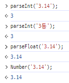

# 학습 내용

- [자료형](#자료형)
- [변수](#변수)

## 자료형

### 문자열 `string`

- JS는 문자열을 선언할 때 큰 따옴표 `"`뿐 아니라 작은 따옴표 `'`를 사용해도 출력이 가능하다.
- 단, 시작과 끝이 다른 종류의 따옴표 일 때는 문제가 발생한다.
- 문자열 안에 따옴표를 넣고 싶다면 이스케이프 문자 `\`를 사용해 예외ㅓ리를 해줘야 에러가 발생하지 않는다.
- 문자열을 합치는 것도 가능하다.
- 문자열 내에서 줄을 바꾸고 싶다면 줄바꿈 기호 `\n`을 입력한다.
  <br/>


- 백틱을 사용해서 문자열을 출력 가능하다. 백틱은 주로 변수를 문자열에 대입할 때 사용한다.
  <br/>


### 숫자 `number`

- `number`는 따옴표로 감싸지 않고 그대로 적으면 된다. 따옴표로 감싸면 문자열로 취급된다.
- `parseInt()`메서드를 사용하면 문자열을 숫자로 바꿀 수 있다.
- `parseFloat()`,`Number()`메서드를 사용하면 문자열을 실수로 바꿀 수 있다.
  <br/>



### NaN

- Not a Number의 축약어로, 해당 값이 숫자가 아닐 때 출력된다.
- `Number()`의 파라미터를 변환시 문자가 포함되어 있으면 NaN이 출력된다.
- 하지만, NaN은 `number`타입이다.
  <br/>


### 산술연산자

- `+` `-` `*` `/` `%`와 같은 연산자를 사용해 산술 연산을 할 수 있다.
- 추가로 제곱 연산을 진행하는 `**`연산자도 존재한다.
  <br/>


### 무한값

- 숫자를 0으로 나누는 것은 성립하지 않는다. 자바에서는 정수를 0으로 나누면 `ArismethicException`이 발생하는데, 자바스크립트는 별도의 자료형이 존재한다.
  <br/>

- 

### 문자와 숫자 더하기

- JS는 자동 형변환을 지원한다. 따라서 `string`과 `number`간의 연산이 가능하다.
  <br/>


### `boolean`

- 참, 거짓을 나타내는 `boolean`자료형이 있다. 동일하게 `true`와 `false`로 구분된다.
- 비교 연산자 `<` `>` `<=` `>=` `==` `===` `!==` `!===` 을 사용해 `boolean`값을 얻을 수 있다.
  <br/>


- `'5' == 5` 과 `'5' === 5`는 결과가 다르게 나온다.
    - `==` 연산자는 형변환을 통해 값만 비교하지만, `===`연산자는 타입까지 비교하기 때문이다.

### 논리 연산자

- AND 연산자 `&&`, OR 연산자 `||`가 있다.
- false, ''(빈 문자열), 0, NaN, undefined, null은 `boolean`으로 형변환 시 `false`가 된다.
- `&&`연산자는 앞에 나오는 값이 참이라면 뒤에 나오는 값을 결과로 보내고, 앞에 나오는 값이 거짓이면 앞에 나오는 값을 결과로 보낸다.
- `||`연산자는 반대로 앞에 나오는 값이 참이라면 앞에 나오는 값을 결과로 보내고, 앞에 나오는 값이 거짓이면 뒤에 나오는 값을 결과로 보낸다.
  <br/>


<br/>

- 널 병합 연산자라 부르는 `??`연산자도 존재한다. 앞에 나오는 값이 null or undefined면 뒤에 나오는 값을 결과로 보내고, null 도 undefined도 아니라면 앞에 나오는 값을 결과로 보낸다.

### `undefined`

- 보통 반환할 값이 없을 때 나오는 자료형이다. `undefined`의 자료형은 `undefined`다.

### `null`

- `null`도 비어있는 값을 의미한다.

### `undefined`와 `null`의 차이

- `undefined`는 "정의되지 않은 상태"를 의미한다.
    - 변수를 선언했지만 초기화 하지 않은 경우
    - 함수가 명시적으로 반환값을 지정하지 않았을 때
    - 객체에서 존재하지 않는 속성에 접근했을 때

```javascript
let foo;
console.log(foo); // undefined

function noReturn() {
}

console.log(noReturn()); // undefined

const obj = {};
console.log(obj.someProperty); // undefined
``` 

- `null`은 "아무 값도 없다"는 것을 명시적으로 표현하기 위해 사용한다.
    - 변수에 값이 비어있음을 명시적으로 나타내기 위해 사용

```javascript
let foo = null;
console.log(foo); // null
```

- 메모리 관점에서 보면 `null`은 값이 입력될 메모리는 할당되어 있는 것이고, `undefined`는 값이 초기화 되지 않은 상태를 의미한다.

### 변수

- 값을 임시로 저장해 사용할 수 있도록 해준다.
- 변수명과 값은 메모리에 저장되고, 변수 선언시 별도의 메모리를 할당받는다.

```javascript
let foo = 'bar'; // foo 라는 이름의 변수에 bar 라는 문자열을 값으로 초기화
let empty; // 초기화 하지 않고 선언만 할 수 있다. 대신 호출시 undefined 반환 
```

- JS의 변수는 `cosnt`, `let`, `var`로 나뉘어져 있다.
- `const`는 상수로, 값을 변경할 수 없다.
    - 주로 값이 수정되지 않아야 하는 변수를 `cosnt`로 설정해 안전하게 코드를 작성한다.
- 이전에는 `var`를 많이 사용 했지만, 요즘은 `let`과 `cosnt`로 변수를 선언하는 방식을 사용한다.
    - `var`는 기존에 선언한 변수를 다시 선언해도 에러가 발생하지 않는다.
    - 예약어로 설정된 단어를 변수명으로 사용할 수 있다.
    - 위와 같은 문제점으로 인해 `var`를 지양하라고 권고한다.