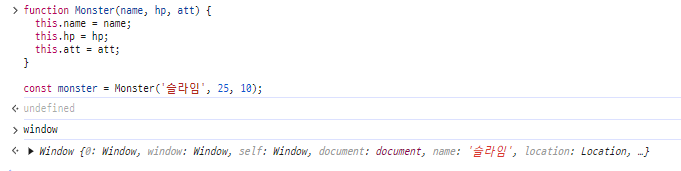

# 학습내용

- [클래스](#클래스)

## 클래스

- 클래스는 객체를 생성하기 위한 템플릿이다.

### 함수로 객체를 생성하는 방법

- ES2015에서 클래스를 추가하기 전에는 객체를 동적으로 생성하려면 함수를 사용했다.
- 객체를 미리 만들어두지 않고 필요할 때마다 생성했다.
- 아래와 같은 팩토리 메서드 패턴을 사용해서 구현하였다.

```javascript
function createMonster(name, hp, att) {
  return {name, hp, att};
}

const monster1 = createMonster('슬라임', 25, 10);
const monster2 = createMonster('슬라임', 26, 9);
const monster3 = createMonster('슬라임', 25, 11);
```

- `new`키워드를 사용해 함수를 호출하여 새로운 객체를 생성할 수도 있다.
    - `this`키워드는 새롭게 생성된 객체를 가리킨다.

```javascript
function Monster(name, hp, att) {
  this.name = name;
  this.hp = hp;
  this.att = att;
}

const monster1 = new Monster('슬라임', 25, 10);
const monster2 = new Monster('슬라임', 26, 9);
const monster3 = new Monster('슬라임', 25, 11);
```

### `this` 이해하기

- `this`는 상황에 따라 값이 달라진다. 기본적으론 `window`객체를 가리키므로, 그 외 경우에 어떤 값을 가지는 지 알아야한다.

- 아래 코드에서는 `this`가 `window`객체를 가리킨다.

```javascript
function foo() {
  console.log(this);
};
a(); // window {}
```

- 그래서 `new`를 붙이지 않고 생성자 함수를 호출하면 `this.name = name`에서 `window.name`이 변경된다.
  <br/>
  

- 객체 메서드로 `this`를 사용하면 `this`는 해당 객체를 가리킨다.
    - 단, 메서드에 구조분해 할당을 적용하면 `this`가 객체 자신을 가리키지 않는다. 반드시 `객체.메서드()` 형태로 사용해야만 `this`가 객체 자신이 된다.

```javascript
const b = {
  name: '제로초',
  sayName() {
    console.log(this === b);
  }
}

b.sayName();
```

- 함수의 `this`는 `bind()` 메서드를 사용해 값을 바꿀 수 있다.
- `bind()` 메서드는 JS 내장 메서드로 `this`를 수정하는 역할을 한다.
- 화살표 함수는 `bind()를 해도 `this`를 바꿀 수 없다.

```javascript
const obj = {name: 'zerocho'};

function a() {
  console.log(this);
}

const b = () => {
  console.log(this);
}

a.bind(obj)(); // {name : 'zerocho'}

b.bind(obj)(); // window 
```

- 따라서 `this`가 외부 요인 때문에 바뀌는 것을 원하지 않는다면 화살표 함수를 사용하면 된다.
    - 화살표 함수는 기존 `this`를 유지한다.

```javascript
const b = {
  name: '제로초',
  sayName() {
    const whatIsThis = () => {
      console.log(this);
    }
    whatIsThis();
  }
}
```

### 클래스로 객체를 생성하는 법

- `class` 키워드로 클래스를 선언하고 `contructor` 메서드 안에 생성할 값을 넣어주면 된다.
    - 클래스에 `new`를 붙여 호출하면 `constructor()`메서드가 실행되고 객체가 반환된다.

```javascript
class Montser {
  consutructor(name, hp, att) {
    this.name = name;
    this.hp = hp;
    this.att = att;
  }
}

const monster1 = new Monster('슬라임', 25, 10);
```

- 클래스의 장점은 객체의 속성과 메서드를 하나로 묶을 수 있다는 것에 있다.

```javascript
class Monster {
  contructor(name, hp, att) {
    this.name = name;
    this.hp = hp;
    this.att = at;
  }

  attack(monster) {
    monster.hp -= this.att;
  }
}
```

### 클래스 상속하기

- 클래스는 상속하기 쉽다.
- 예를 들어 `Hero`클래스를 만들어야하는데, `Monster`클래스처럼 이름, 체력, 공격력이 속성으로있고 ,공격 메서드도 가지고 있다.
    - 하지만 체력을 회복하는 `heal()` 메서드와 최대 체력을 나타내는 `maxHp` 속성을 별도로 가지고 있다.
- 이럴 때 `Hero`클래스를 `Monster`클래스와 별도로 작성한다면 중복 코드가 많아진다.
- 상속을 통해서 중복 코드를 한 클래스에서 관리할 수 있다.

[상속 적용 전]

```javascript
class Hero {
  constructor(name, hp, att) {
    this.name = name;
    this.hp = hp;
    this.att = att;
    this.maxHp = hp;
  }

  attack(monster) {
    monster.hp -= this.att;
  }

  heal() {
    this.hp = this.maxHp;
  }
}
```

[상속 적용 후]

```javascript
class Unit {
  constructor(name, hp, att) {
    this.name = name;
    this.hp = hp;
    this.att = att;
  }

  attack(target) {
    target.hp -= this.att;
  }
}

class Hero extends Unit {
  constructor(name, hp, att) {
    super(name, hp, att); // 부모 생성자 호출 
    this.maxHp = hp;
  }

  attack(target) {
    super.attack(target);
    console.log('부모 클래스 동작 외의 추가 동작 시 메서드 오버라이딩')
  }

  heal() {
    this.hp = this.maxHp;
  }
}

class Monster extends Unit {
  constructor(name, hp, att) {
    super(name, hp, att);
  }

  attack(target) {
    super.attack(target);
  }
}
```